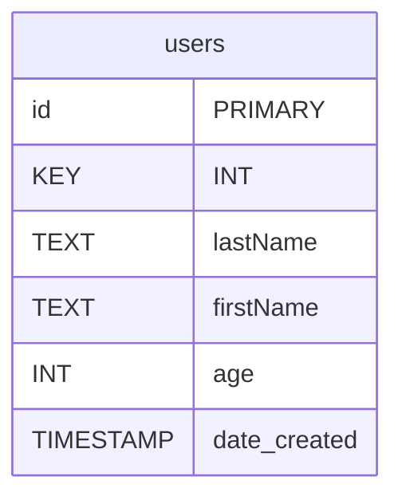
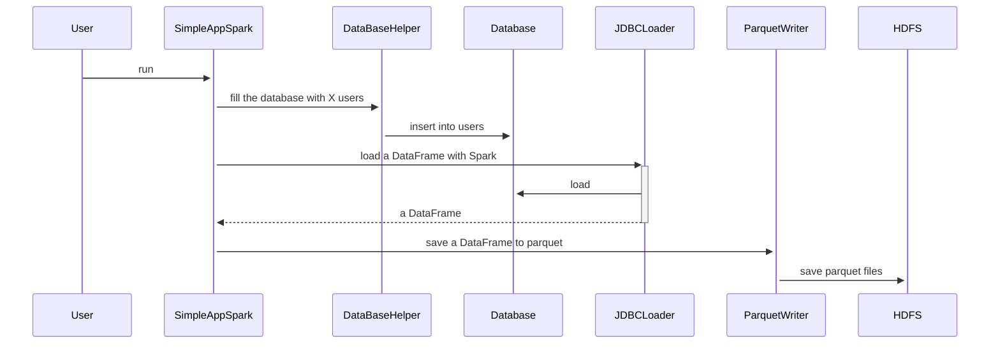

# A simple example of how to correctly query a large JDBC database

## What does this example do?


## 🚀How to run this example 

```bash 
sbt run
```

## 📁 Structure of the project 

```bash
.
|-- main
|   `-- scala
|       |-- DatabaseHelper.scala
|       |-- Faker.scala
|       |-- JDBCDriverEnumeration.scala
|       |-- JDBCLoader.scala
|       |-- ParallelDemo.scala
|       `-- SimpleSparkApp.scala
`-- test
    `-- scala
        |-- DatabaseHelperTest.scala
        |-- FakerTest.scala
        |-- JDBCDriverEnumerationTest.scala
        |-- JDBCLoaderTest.scala
        |-- ParallelDemoTest.scala
        `-- container
            |-- MinioContainer.scala.scala
            `-- PostgresContainer.scala

```


## What this example is doing ?
 
### 👉 The data model of the source

```sql
CREATE TABLE IF NOT EXISTS users 
    (id INT PRIMARY KEY, firstName TEXT, 
     lastName TEXT, age INT, 
     numFriends INT, 
     date_created TIMESTAMP)
```



### 👉 A sequence diagram to explain the flow of the application



### The transformation

TODO


### The data model of the destination

A parquet file with the same schema as the source


Created with ❤️ by Raphaël MANSUY
